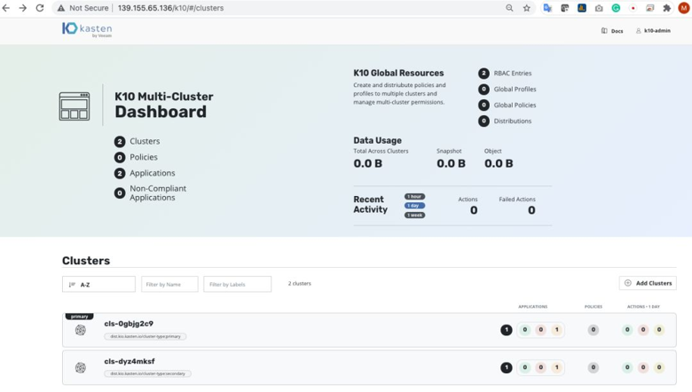

Veeam's Overview
========================

.. image:: images/veeambanner.png

* Veeam Software is a privately held, U.S. information technology company with a U.S. based leadership team.

* Founded in 2006, we focused on simplifying backups for virtual machines. We quickly became the industry leader. Veeam continues to charge forward to innovate the industry so you can own, control and protect your data anywhere in the hybrid cloud.

* In March 2020, Veeam was acquired by Insight Partners which has enable us to expand into new markets and continue our growth trajectory.

* Veeam named a Leader for the 6th time!

.. image:: images/gartner.png

Veeam's Vision
------------

To be the most trusted provider of backup, recovery and data management solutions that deliver Modern Data Protection.

Veeam Product 
--------------

*Veeam Backup & Replication (aka VBR)*
^^^^^^^^^^^^^^^^^^^^^^^^^^
 
|vbr| Initially a product for VM protection, now central  management & protection place with built-in  agents and platform services.

.. |vbr| image:: images/vbr.png
         :scale: 60

.. rst-class:: clear-both

*Veeam One*
^^^^^^^^^^^

|veeamone| Deliver deep, intelligent monitoring, reporting and automation through interactive tools and intelligent learning, identifying.

.. |veeamone| image:: images/veeamone.png

.. image:: images/veeamone01.png 

.. rst-class:: clear-both

*Veeam Backup for Public Cloud(include AWS, GCP, AZURE)* 
^^^^^^^^^^^^^^^^^^^^^^^^^^^^^^^
  
|vbpublic| Cloud-native, web-based console for AWS/Azure,  available via Marketplace.

.. |vbpublic| image:: images/vbpublic.png

.. image:: images/vbpublic01.png 

.. rst-class:: clear-both

*Veeam Disaster Recovery Orchestrator(aka VDRO)*
^^^^^^^^^^^^^^^^^^^^^^^^^^^^^^^

|vdro|A disaster recovery solution should be easy to configure, and easy to use.

.. rst-class:: clear-both

*Veeam Backup for O365(aka VBO)*
^^^^^^^^^^^^^^^^^^^^^^^^^^^^^^^

|vbo| Retrieve Office 365 Exchange Online, SharePoint Online, OneDrive and Teams for Business data from a cloud-based instance of Office 365.

.. |vbo| image:: images/vbo.png

.. image:: images/vbo01.png

.. rst-class:: clear-both 

*Veeam Service Provider Console(aka VSPC)*
^^^^^^^^^^^^^^^^^^^^^^^^^^^^^^^

|vspc| Cloud-enabled platform for Veeam Cloud & Service Providers (VCSP) partners and distributed enterprise environments to deliver expert-built and managed Backup as a Service (BaaS) and Disaster Recovery as a Service (DRaaS).

.. |vspc| image:: images/vspc.png 

.. rst-class:: clear-both

*Kasten K10(aka K10)*
^^^^^^^^^^^^^^^^^^^^^^^^^^^^^^^

|k10| Protect Your Fleet of Kubernetes Deployments with Multi-Cluster Support and Retain Control of and Access to Your Data.

.. rst-class:: clear-both