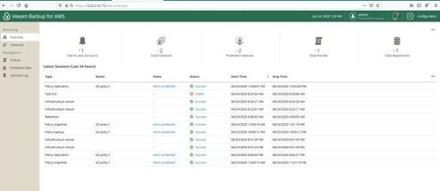

Veeam Company's Overview
========================

.. image:: images/veeambanner.png

* Veeam Software is a privately held, U.S. information technology company with a U.S. based leadership team.

* Founded in 2006, we focused on simplifying backups for virtual machines. We quickly became the industry leader. Veeam continues to charge forward to innovate the industry so you can own, control and protect your data anywhere in the hybrid cloud.

* In March 2020, Veeam was acquired by Insight Partners which has enable us to expand into new markets and continue our growth trajectory.

* Veeam named a Leader for the 6th time!

Veeam Vision
------------

To be the most trusted provider of backup, recovery and data management solutions that deliver Modern Data Protection.

Veeam Product 
--------------

*Veeam Backup & Replication*
^^^^^^^^^^^^^^^^^^^^^^^^^^

.. image:: images/vbr.png 
    :alt: Left floating image
    :target: https://www.veeam.com/vm-backup-recovery-replication-software.html
    :class: with-shadow float-left
    :scale: 50    

Initially a product for VM protection, now central  management & protection place with built-in  agents and platform services.

.. image:: images/vbr01.png 
.. rst-class:: clear-both

*Veeam One*
^^^^^^^^^^^

.. image:: images/veeamone.png 
    :alt: Left floating image
    :target: https://www.veeam.com/virtualization-management-one-solution.html
    :class: with-shadow float-left

Deliver deep, intelligent monitoring, reporting and automation through interactive tools and intelligent learning, identifying

.. image:: images/veeamone01.png 
.. rst-class:: clear-both

*Veeam Backup for Public Cloud*
^^^^^^^^^^^^^^^^^^^^^^^^^^^^^^^

.. image:: images/vbpublic.png 
    :alt: Left floating image
    :target: https://www.veeam.com/cloud-backup-solutions.html
    :class: with-shadow float-left

Cloud-native, web-based console for AWS/Azure,  available via Marketplace

