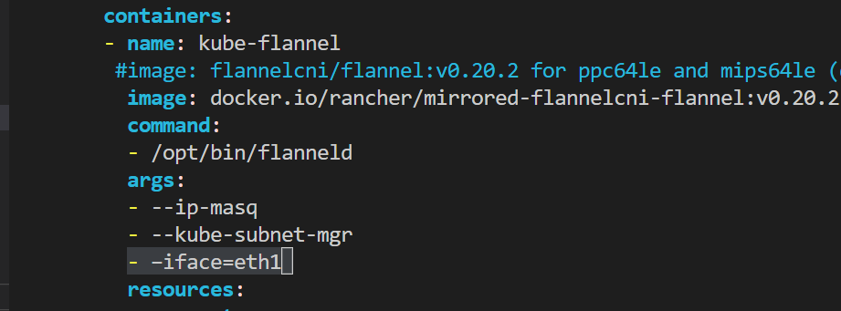

K8S Setup
=========

Kubernetes is an open-source platform for managing containers such as Docker. Is a management system that provides a platform for deployment automation. With Kubernetes, you can freely make use of the hybrid, on-premise, and public cloud infrastructure to run deployment tasks of your project.

And Docker lets you create containers for a pre-configured image and application. Kubernetes provides the next step, allowing you to balance loads between containers and run multiple containers across multiple systems.

This guidebook will walk you through How to Install Kubernetes on Ubuntu 20.04.

K8S Environment Setup
---------------------

Using Vagrant to build the K8S Environment. This setup includes 1 master node and 2 worker nodes. 1

.. list-table:: K8S_Host_Settings
   :widths: 25 25 25 25 25 25
   :header-rows: 1

   * - Hostname
     - IP Address
     - vCPU
     - vRAM
     - vDisk
     - OS
   * - k8s-m1
     - 10.110.10.80
     - 2
     - 2
     - 120G
     - generic/ubuntu2004
   * - k8s-w1
     - 10.110.10.81
     - 4
     - 4
     - 120G
     - generic/ubuntu2004
   * - k8s-w2
     - 10.110.10.82
     - 4
     - 4
     - 120G
     - generic/ubuntu2004

Setting the ENV variables
Before running vagrant , please add ENV variables first.

Create .profile file and run source .profile

.profile:

.. code-block:: bash

    export ESXI_HOSTNAME="host ip address"
    export ESXI_USERNAME="username"
    export ESXI_PASSWORD="password"

run following command to add ENV variables

.. code-block:: bash

    source ~/.profile

Vagrantfile:

.. code-block:: ruby

    Vagrant.require_version ">= 1.6.0"

    boxes = [
        {
            :name => "k8s-m1",
            :eth1 => "10.110.10.86",
            :netmask => "255.255.255.0",
            :mem => "4096",
            :cpu => "2"

        },
        {
            :name => "k8s-w1",
            :eth1 => "10.110.10.87",
            :mem => "4096",
            :netmask => "255.255.255.0",        
            :cpu => "4"

        },
        {
            :name => "k8s-w2",
            :eth1 => "10.110.10.88",
            :netmask => "255.255.255.0",
            :mem => "4096",
            :cpu => "4"

        }
    ]

    Vagrant.configure(2) do |config|

    # config.vm.box = "ubuntu/jammy64"
    config.vm.box = "generic/ubuntu2004"  #ubuntu 20.04  generic/ubuntu1804  ubuntu/focal64 bento/ubuntu-20.04
    config.vm.box_download_insecure = true
    boxes.each do |opts|
        config.vm.define opts[:name] do |config|
            config.vm.hostname = opts[:name]

            config.vm.provider "vmware_fusion" do |v|
            v.vmx["memsize"] = opts[:mem]
            v.vmx["numvcpus"] = opts[:cpu]
            end

            config.vm.provider "virtualbox" do |v|
            v.customize ["modifyvm", :id, "--memory", opts[:mem]]
            v.customize ["modifyvm", :id, "--cpus", opts[:cpu]]
            end

            config.vm.provider "vmware_esxi" do |v|
            v.esxi_hostname = ENV['ESXI_HOSTNAME']
            v.esxi_username = ENV['ESXI_USERNAME']
            v.esxi_password = ENV['ESXI_PASSWORD']
            # v.esxi_password = 'prompt:'    
            v.esxi_virtual_network = ['vagrant-private', 'swguest110']
            v.esxi_disk_store = 'ESXI02_Datastore'
            v.guest_name = opts[:name] 
            v.guest_username = 'vagrant'
            v.guest_memsize = opts[:mem]
            v.guest_numvcpus = opts[:cpu]
            v.guest_disk_type = 'thin'
            v.guest_boot_disk_size = '30'
            v.guest_nic_type = 'e1000'
            v.guest_virtualhw_version = '14'
            v.debug = 'true'

            # v.customize ["modifyvm", :id, "--memory", opts[:mem]]
            # v.customize ["modifyvm", :id, "--cpus", opts[:cpu]]
            end

            # config.vm.network :private_network, type: "dhcp"
            config.vm.network :public_network, ip: opts[:eth1], netmask: opts[:netmask], gateway: "10.110.10.254", dns: "10.110.10.101"
        end
    end
    config.vm.provision "shell", privileged: true, path: "./setup.sh"
    end

K8S Setup
----------

1. Check Version for kubeadm, kubelet, kubectl

.. code-block:: bash

    kubeadm version
    kubelet --version
    kubectl version

2. Initizalize K8S cluster - do it on **master** node
   
- --apiserver-advertise-address=master interface IP
- --pod-network-cidr=your k8s pod network

.. code-block:: bash

    sudo kubeadm init --apiserver-advertise-address=10.110.10.86  --pod-network-cidr=10.244.0.0/16 

1. Check joining cluster command

.. code-block:: bash

    sudo kubeadm token create --print-join-command

4. worker node join to cluster - do it on **worker** node

.. code-block:: bash

    sudo kubeadm join 10.110.10.86:6443 --token 3a5thm.2046hzjtm7mlnj2i \
            --discovery-token-ca-cert-hash sha256:8303a5d9d2b8e758f34a9bbd0d971b288974d4045af47caa45c0cef3f29d3f30 

5. Setup kubectl ENV  - do it on **master** node

.. code-block:: bash

    mkdir -p $HOME/.kube
    sudo cp -i /etc/kubernetes/admin.conf $HOME/.kube/config
    sudo chown $(id -u):$(id -g) $HOME/.kube/config
    source <(kubectl completion bash)
    echo 'source <(kubectl completion bash)' >>~/.bashrc

6. download flannel

.. code-block:: bash

    wget https://raw.githubusercontent.com/flannel-io/flannel/master/Documentation/kube-flannel.yml

7. edit kube-flannel.yml,  add the line [ - --iface=eth1  ], apply kube-flannel.yml

.. code-block:: bash
    
    kubectl apply -f kube-flannel.yml 

8. download helm installation script file
   
.. code-block:: bash

    curl -fsSL -o get_helm.sh https://raw.githubusercontent.com/helm/helm/main/scripts/get-helm-3
    chmod 700 get_helm.sh

9. install helm
    
.. code-block:: bash

    ./get_helm.sh 

10. helm add repo and install csi-driver-nfs
    
.. code-block:: bash

    helm repo add csi-driver-nfs https://raw.githubusercontent.com/kubernetes-csi/csi-driver-nfs/master/charts
    helm install csi-driver-nfs csi-driver-nfs/csi-driver-nfs --namespace kube-system --version v4.1.0

11. helm add ceph-csi repo

.. code-block:: bash    

    helm repo add ceph-csi https://ceph.github.io/csi-charts
    kubectl create namespace "ceph-csi-rbd"
    helm install --namespace "ceph-csi-rbd" "ceph-csi-rbd" ceph-csi/ceph-csi-rbd

12. create csi-nfs storageclass

.. code-block:: bash  

    cat <<'EOF'> storageclass-csi-nfs.yaml | kubectl apply -f storageclass-csi-nfs.yaml
    ---
    apiVersion: storage.k8s.io/v1
    kind: StorageClass
    metadata:
    name: csi-nfs
    annotations:
        storageclass.kubernetes.io/is-default-class: "true"
    provisioner: nfs.csi.k8s.io
    parameters:
    server: 10.110.10.83
    share: /nfs/export1/
    # csi.storage.k8s.io/provisioner-secret is only needed for providing mountOptions in DeleteVolume
    # csi.storage.k8s.io/provisioner-secret-name: "mount-options"
    # csi.storage.k8s.io/provisioner-secret-namespace: "default"
    reclaimPolicy: Delete
    volumeBindingMode: Immediate
    mountOptions:
    - nconnect=8  # only supported on linux kernel version >= 5.3
    - nfsvers=4.1
    EOF

13. create csi-nfs storageclass

.. code-block:: bash  

    cat <<'EOF'> storageclass-csi-nfs-backup.yaml | kubectl apply -f storageclass-csi-nfs-backup.yaml
    ---
    apiVersion: storage.k8s.io/v1
    kind: StorageClass
    metadata:
    name: csi-nfs-backup
    provisioner: nfs.csi.k8s.io
    parameters:
    server: 10.110.10.83
    share: /nfs/export2/
    # csi.storage.k8s.io/provisioner-secret is only needed for providing mountOptions in DeleteVolume
    # csi.storage.k8s.io/provisioner-secret-name: "mount-options"
    # csi.storage.k8s.io/provisioner-secret-namespace: "default"
    reclaimPolicy: Delete
    volumeBindingMode: Immediate
    mountOptions:
    - nconnect=8  # only supported on linux kernel version >= 5.3
    - nfsvers=4.1
    EOF

15. create volumesnapshotclass, volumesnapshotcontent, volumesnapshotclass

.. code-block:: bash  

    kubectl create -f  https://raw.githubusercontent.com/kubernetes-csi/external-snapshotter/release-3.0/client/config/crd/snapshot.storage.k8s.io_volumesnapshotclasses.yaml
    kubectl create -f  https://raw.githubusercontent.com/kubernetes-csi/external-snapshotter/release-3.0/client/config/crd/snapshot.storage.k8s.io_volumesnapshotcontents.yaml
    kubectl create -f  https://raw.githubusercontent.com/kubernetes-csi/external-snapshotter/release-3.0/client/config/crd/snapshot.storage.k8s.io_volumesnapshots.yaml

16. volumestorageclass

.. code-block:: bash  

    cat <<'EOF'> volumestorageclass.yaml | kubectl apply -f volumestorageclass.yaml
    apiVersion: snapshot.storage.k8s.io/v1beta1
    kind: VolumeSnapshotClass 
    metadata:
      annotations:
        k10.kasten.io/is-snapshot-class: "true"
      name: csi-nfs-snap
    driver: nfs.csi.k8s.io
    deletionPolicy: Delete
    EOF

17. helm add repo and install kasten K10
    
.. code-block:: bash  

    kubectl create namespace kasten-io
    helm repo add kasten https://charts.kasten.io/

    helm install k10 kasten/k10 --namespace kasten-io \
      --set global.persistence.metering.size=20Gi \
      --set prometheus.server.persistentVolume.size=20Gi \
      --set global.persistence.catalog.size=20Gi \
      --set injectKanisterSidecar.enabled=true \
      --set injectKanisterSidecar.enabled=true \
      --set-string injectKanisterSidecar.namespaceSelector.matchLabels.k10/injectKanisterSidecar=true \
      --set auth.tokenAuth.enabled=true \
      --set auth.basicAuth.htpasswd='admin:$apr1$nj8m0exb$RIkh3QZlbMUk4mXXHCTSG.'  

18. set k10 nodeport
    
.. code-block:: bash  

    cat > k10-nodeport-svc.yaml << EOF | kubectl apply -f k10-nodeport-svc.yaml
    apiVersion: v1
    kind: Service
    metadata:
      name: gateway-nodeport
      namespace: kasten-io
    spec:
      selector:
        service: gateway
      ports:
      - name: http
        port: 8000
        nodePort: 32000
      type: NodePort
    EOF

19. check kasten io 

.. code-block:: bash  

    curl -s https://docs.kasten.io/tools/k10_primer.sh  | bash

20. deploy shopping website 

.. code-block:: bash 

    git clone https://github.com/microservices-demo/microservices-demo.git
    cd microservices-demo/deploy/kubernetes
    kubectl apply -f complete-demo.yaml
    ### run application using browser
    ## http://10.110.10.86:30001/

21. check kasten io 

.. code-block:: bash  

    kubectl label namespace generic k10/injectKanisterSidecar=true 