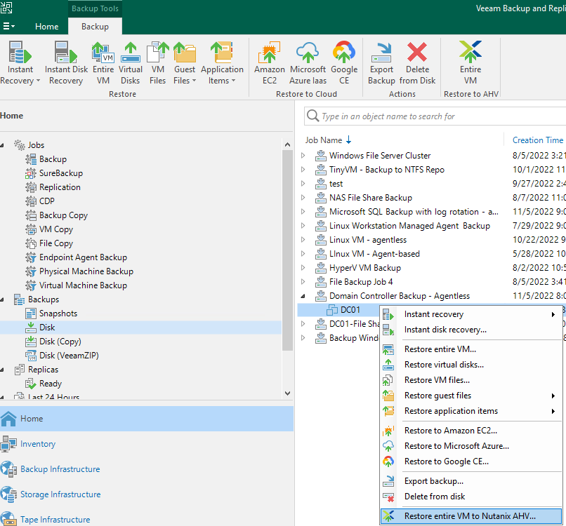
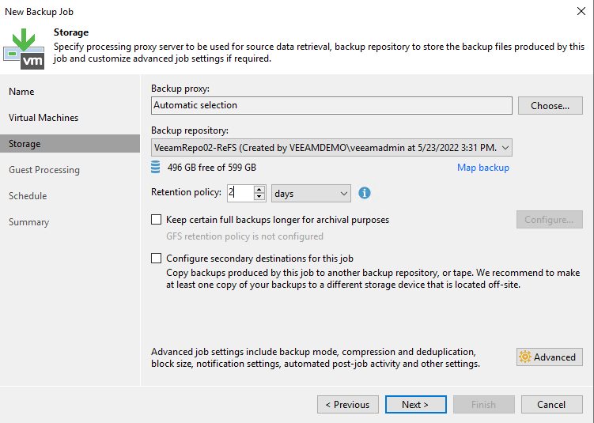

VBR - File Level Restore
========================
We hava a Domain Controller VM Backup Policy (*"Domain Controller Backup - Agentless"*)

Step-By-Step
------------

Using Veeam Explore to browser your deleted/modified objects for restore.

1. Click on Navigation, Backups, Disk. On the Right, choose *"Domain Controller Backup - Agentless"* - *"DC01"*
   Right Click - *"Restore application items"*, *"Microsoft Active Directory objects..."*

2. Select your restore point, and click *"Next"*

3. Type your restore point reason, and click *"Next"* 

.. image:: ../images/lab03/lab02_03.png

1. Click *"Browse"*, Veeam Explorer For Active Directory will be opened.

.. image:: ../images/lab02/lab02_04.png

.. image:: ../images/lab02/lab02_04.png

4. Leave Automatic selection for Backup proxy.

5. Confirm Main Backup Repository is selected as Backup repository in the drop down menu.

6. Change the Restore points to keep on disk to 2. 

7. Click Advanced to specify advanced options for the backup job.
   
8. Leave Incremental selected under Backup mode and click OK and Next.
   
9.  Do not enable synthetic or active full: This way the backup chain will be created in the Forever Forward incremental backup mode. 
   

   
10. From the Guest OS Credentials dropdown box, choose the Domain Administrator (veeamlab\administrator).. 

11. Click on the "Applications" button.  Select Tiny-Veeam from the list and click Edit.
    
12. Select the Disable application processing radio button. Click OK. And then click OK again. 
    
    Tiny-Veeam is a linux VM so it does not have VSS framework on it, therefore we choose to disable application-aware image processing for this VM.

13. Click Test Now and watch the test complete. Notice that Tiny-Veeam fails guest credentials. That's to be expected and is ok.  

14. Click Close as the testing completes.

15. Click Next to proceed.

16. Schedule this job to run daily. Click APPLY to proceed.
    There is no option to schedule the automatic retry for jobs configured to start only manually. 

17. Click Finish
    
18. Click Finish. Feel free to review the job by right clicking and selecting Edit. To keep the lab cleaned up for others, please delete your job when you’re done. 

