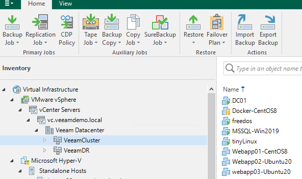

Lab Demo
======

Lab 1. Create a VeeamZIP Job
-------------------------

With Veeam Backup & Replication, you can quickly perform backup of one or several VMs with VeeamZIP.
VeeamZIP is similar to a full VM backup. 
The VeeamZIP job always produces a full backup file (VBK) that acts as an independent restore point. 
You can store the backup file to a backup repository, to a local folder on the backup server or to a network share.
If Veeam Backup and Replication isn't already running, then double click the Veeam Backup and Replication Console icon located on the desktop. 

Step-By-Step
^^^^^^^^^^^^

1. Open the Inventory view.
2. In the infrastructure tree, choose VMware vSphere, vCenter Servers, vc.veeamdemo.local, Veeam Datacetner, VeeamCluster.
   

3. In the working area, right-click tinyLinux and select VeeamZIP…
4. In the open window in the Destination section, review a location to which you want to store the VeeamZIP file.
Use the Delete this backup automatically list to specify retention settings for the created VeeamZIP file. Select 'in 1 week' from the drop-down list.
By default, VeeamZIP files are not removed but are kept in the specified location for an indefinite period of time.
5. To review additional options for the VeeamZIP file, click More.
As we did not select a password, Veeam Backup & Replication will produce an unencrypted VeeamZIP file. By default, Veeam Backup & Replication uses application-aware image processing to create a transactionally consistent backup of VMs running applications with VSS support. If you were backing up VMs that run something other than Windows OS or applications without VSS support, you could disable this option by clearing Disable guest quiescence checkbox

6. Click OK. The VeeamZIP job will start immediately.
You can click Show Details to view the status of the VeeamZIP job. You may also click OK and continue with the labs. To monitor job progress, navigate to the Backup & Replication section, choose Last 24 hours, and then click Running

