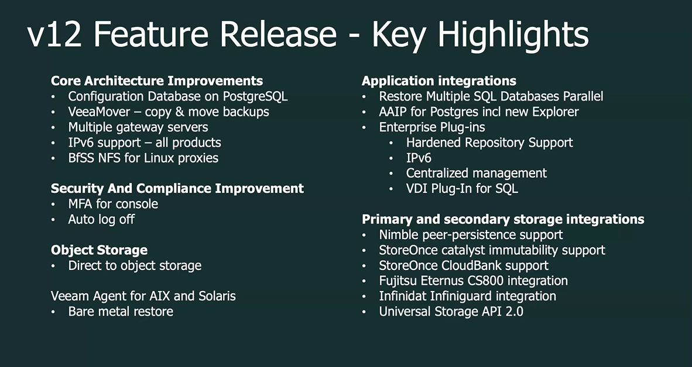

V12 Features 
=============

New capabilities introduced with V12 include:

- Backups going direct to object storage and cloud-based agents are also available as cloud-accelerated features
- With immutability everywhere, ransomware can be recovered, and threats against cyberattacks can be stopped even faster
- Improves efficiency at scale with additional enterprise application support and innovations
- A new Veeam Backup & Replication plug-in for Kasten by Veeam K10 V5.0 provides visibility and management for Kubernetes data protection.

Key Highlights
--------------

