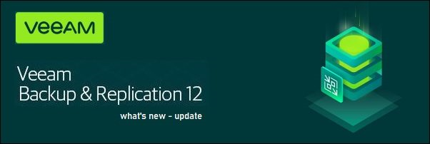

V12 Update
========

Purpose built for Kubernetes, Kasten K10 is a Cloud Native data management platform for Day 2 operations. It provides enterprise DevOps teams with an easy to use, scalable and secure system for backup/restore, disaster recovery and application mobility for Kubernetes applications. Kasten K10 integrates with relational and NoSQL databases, all major Kubernetes distributions, and runs in any cloud to maximize freedom of choice.​

.. toctree::
   :maxdepth: 1
   
   feature
